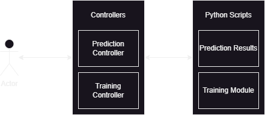

# AGU Data System - Backend Documentation

## Table of Contents

- [Introduction](#introduction)
- [Application Architecture](#application-architecture)
    - [Controller Layer](#controller-layer)
    - [Data Representation](#data-representation)
    - [Error Handling](#error-handling)

## Introduction

This document provides an overview of the backend system of the AGU Prediction System and its conception.
The backend is responsible for creating train models and afterward make predictions for gas consumption data.

## Application Architecture

The application is structured as follows:

- [/http](src/main/kotlin/aguPredictionSystem/server/http) - Contains the controller layer of the application using
  Spring Web MVC.

### Controller Layer

The controller layer is responsible for handling the HTTP requests, processing them and giving back a response; which is
annotated with the `@RestController` and `@RequestMapping`.
The methods are annotated with `@GetMapping`, `@PostMapping` and `@DeleteMapping` depending on the request method.
The responses are returned as a JSON object (Output Models),
and the requests are received as a JSON object (Input Models).

The Controller Layer is organized as follows:

- [controllers](src/main/kotlin/aguPredictionSystem/server/http) - Contains the controllers of the application.
    - [/models](src/main/kotlin/aguPredictionSystem/server/http/models) - Contains the input and output models for data
      operations.

### Data Representation

Due to the simplicity of the application, the data representation is only represented in the controller layer.

- **Input/Output Models**: The input and output models are the representation of the data received and sent in the
  requests.

### Error Handling

The used error handling is done by setting strings, and according to them, giving the user either 400 or 200 responses.
